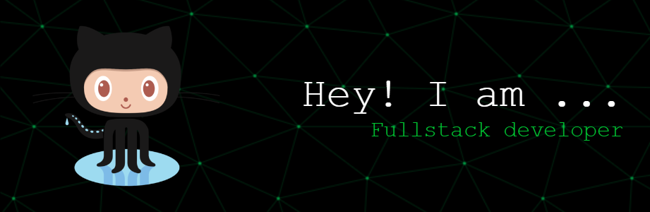
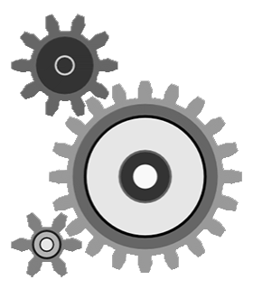

<h1 align="center">Hi Geeks, I'm Shuhbam Kushwaha </h1>

        

    <h2>
        
        About Me
    </h2>
    
    <ul style="list-style: none; padding: 0;">
        <li>
🎓 Graduated my Bachelors in <b>Electronic and Communication Engineering</b> from <b>NIT Allahabad (MNNIT)</b>
</li>
        <li>
🔭 Aspiring to be a <b>Software Developer Engineer</b>
</li>
        <li>
🔭 Presently I am learning <b>DSA</b>
</li>
        <li>
🔭 <b>Web Developer</b>
</li>
        <li>
💬 Talk to me about <b>DSA, Web development, Machine Learning, Hackathons, Tech news</b>
</li>
    </ul>

        
            

    
        
##  Programming Languages

    &nbsp;&nbsp;&nbsp;&nbsp;
    &nbsp;&nbsp;&nbsp;&nbsp;
    &nbsp;&nbsp;&nbsp;&nbsp;
    &nbsp;&nbsp;&nbsp;&nbsp;
    &nbsp;&nbsp;&nbsp;&nbsp;
    &nbsp;&nbsp;&nbsp;&nbsp;
    

##  Frontend Development

    &nbsp;&nbsp;&nbsp;&nbsp;
    &nbsp;&nbsp;&nbsp;&nbsp;
    &nbsp;&nbsp;&nbsp;&nbsp;
    &nbsp;&nbsp;&nbsp;&nbsp;
    &nbsp;&nbsp;&nbsp;&nbsp;
    &nbsp;&nbsp;&nbsp;&nbsp;
    

##  Backend Development

    &nbsp;&nbsp;&nbsp;&nbsp;
     
    &nbsp;&nbsp;&nbsp;&nbsp;
    &nbsp;&nbsp;&nbsp;&nbsp;
    
    

##  AI/ML

    &nbsp;&nbsp;&nbsp;&nbsp;
    &nbsp;&nbsp;&nbsp;&nbsp;
    &nbsp;&nbsp;&nbsp;&nbsp;
    

##  Databases

    &nbsp;&nbsp;&nbsp;&nbsp;
    

##  Other

    &nbsp;&nbsp;&nbsp;&nbsp;
    &nbsp;&nbsp;&nbsp;&nbsp;
    
     &nbsp;&nbsp;&nbsp;&nbsp;
    &nbsp;&nbsp;&nbsp;&nbsp;
    &nbsp;&nbsp;&nbsp;&nbsp;
    

<!----------------------------------------------Editors-------------------------------------------------->
<h2>IDE/Editors</h2>

            
            
            

            
<!------------------------------------------Connect With Me --------------------------------------------->      
<h2> Connect With Me</h2>

            
            
            
            
            
            

<!-----------------------------------------------------------GitHub Analytic---------------------------------------------------->
<h2>  GitHub Analytics</h2>
<!-- 

&nbsp;

 -->

<table>
    <td align="center">
        
    </td>
    <td align="center">
        
    </td>

</table>

    

 

<!------------------------------------------ Github Trophy ----------------------------------->
<h2>Github Trophies</h2>

 

 
<!------------------------------------------Leetcode--------------------------->
<h2>Leetcode Analytics</h2>

 

